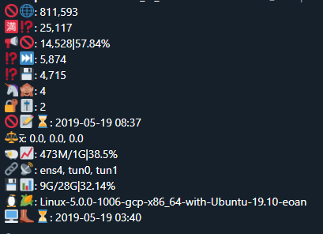

# tweetStats

Send a daily tweet with your Pi-Hole statistics and other system information!

## How to use

1. `git clone https://github.com/mwoolweaver/tweetStats.git`
2. Install Python 3
3. `pip3 install -U -r requirements.txt`
4. Copy `config.json.example` to `config.json` and adjust it `cp config.json.example config.json`
   - `api_path` = Path to your `/admin/api.php` of Pi-Hole
   - Tokens: Create an application [here](https://apps.twitter.com/)
5. Run it! `python3 tweetStats.py` `python3 tweetStats.py -h` -> for help
6. ???
7. Profit

## cmd line args for testing

  *  -db will print the tweet to be sent and all other variables that are used in the proccess.

  *  -dbl will test your twitter credentials to test a successful login.

  *  -dbp will make sure the pi-hole api can be reached. 

## Cronjob

This will tweet your stats at 23:55 everyday and redirects output to ~/tweetStats/tweetStats.txt so you know that it actually worked.

```
55 23 * * * root cd ~/tweetStat/ && python3 tweetStat.py >> ~/tweetStat/twitter_bot.txt
```

# How it looks

```
Tweet 1
#PiHoleStats
Blocklist Size: 761,313
Total Querries: 17,523
Querriess Blocked: 0|0%
Querries Forwarded: 505
Querries Cached: 17,018
Unique Clients: 1
Privacy Level: 2
Gravity Last Updated: 2019-07-16 18:03
#Python

 Tweet 2
#SystemStats
CPU Laod AVG: 0.0, 0.0, 0.0
Ram Usage: 476M/1G|39.0%
Disk Usage: 9G/28G|32.14%
Kernel && OS: Linux-5.0.0-1010-gcp-x86_64-with-Ubuntu-19.10-eoan
Boot Time: 2019-07-16 18:12
#Ubuntu

 Tweet 3
#NetStats
Network Interfaces: ens4, tun0, tun1
Ping: 26.27 ms
Down/Up Speed: 795.43 Mbps/475.43 Mbps
Data Used (dl/ul): 390.41 MB/144.5 MB
IP: 35.222.xx.xx
ISP: Google Cloud
Share: http://www.speedtest.net/result/8436497611.png
#Speedtest
```

